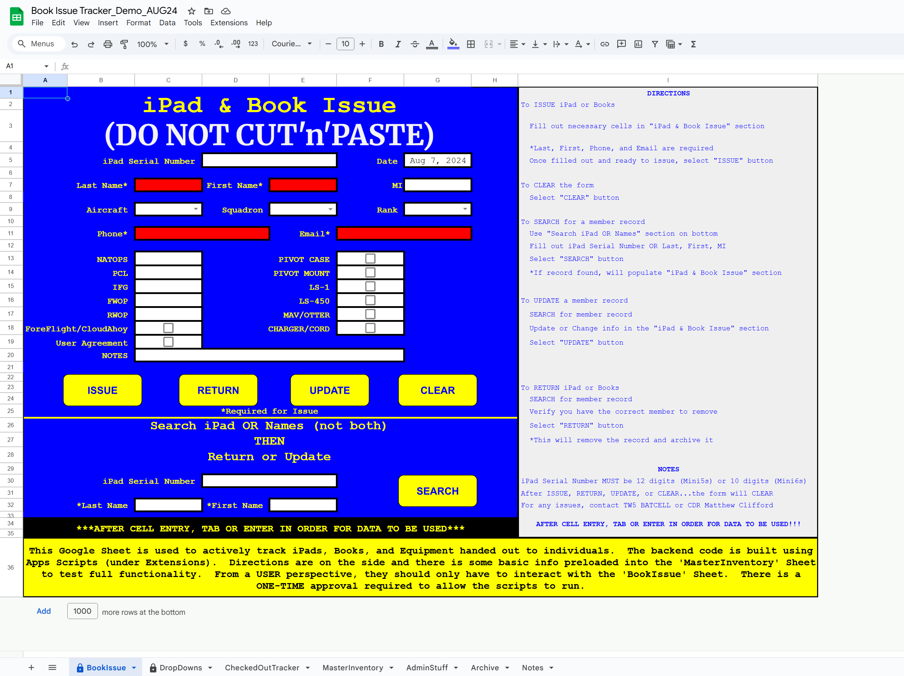
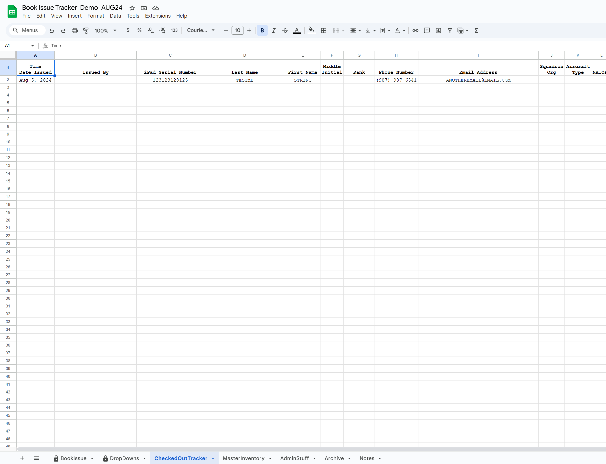
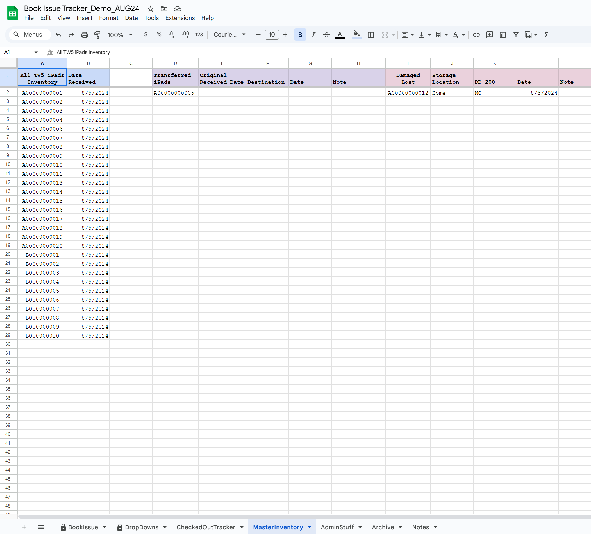
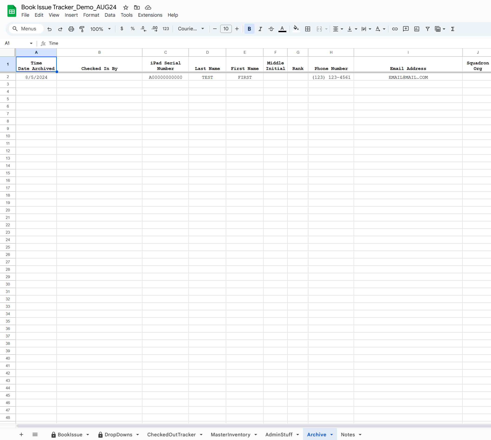
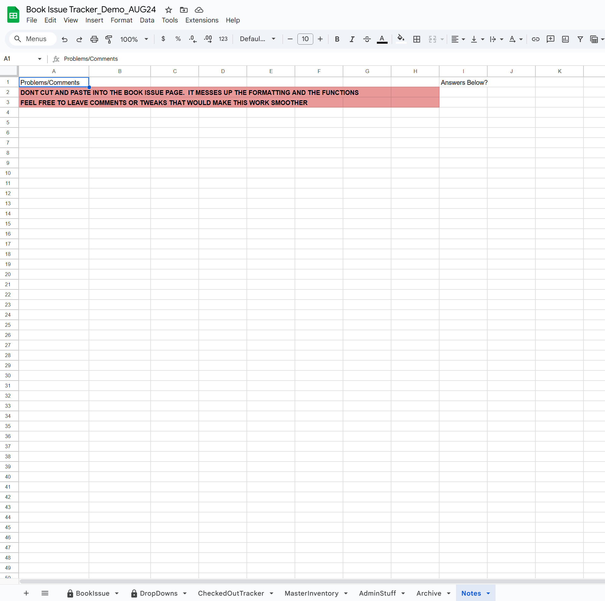

<h1>Digital Library - Book Issue Tracker</h1>

 ### [Book Issue Tracker Demo](https://docs.google.com/spreadsheets/d/1UkGsV5IXth2OZN3fPvLTBC0y6PzStCc_kKKOzNFV9Z4/edit?gid=0#gid=0)

<h2>Description</h2>
Project consists of a digital library used to track iPads, books, and various equipment issued to personnel.  Interface and storage is done through Google Sheets.  Code is through Apps Scripts.
<br />


<h2>Languages and Utilities Used</h2>

- <b>Google Sheets</b> 
- <b>Apps Scripts</b>

<h2>Tracker walk-through:</h2>

<p align="center">BookIssue - Landing Page/Main Page for interaction: </p><br/>
 

<br />
<br />
<p align="center">DropDowns - Selection on BookIssue Sheet (Main page):  </p><br/>


<br />
<br />
<p align="center">CheckedOutTracker - This is where the data is written on an Issue or Update: </p><br/>


<br />
<br />
<p align="center">MasterInventory - Stores the Master inventory, Transferred inventory, Damaged inventory, and list of Non-verified inventory:  </p><br/>


<br />
<br />
<p align="center">AdminStuff - Various Admin uses.  Count issued inventory, Total inventory, Total available inventory, etc:  </p><br/>


<br />
<br />
<p align="center">Archive - This is where the data is written on a Return.  Provides a nice history of who had what:  </p><br/>


<br />
<br />
<p align="center">Notes - This ended up being an easy way to communicate to the book issue staff:  </p><br/>




<!--
 ```diff
- text in red
+ text in green
! text in orange
# text in gray
@@ text in purple (and bold)@@
```
--!>
